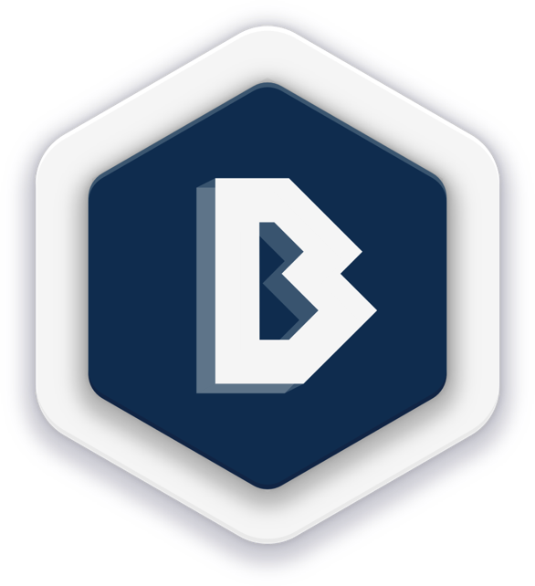
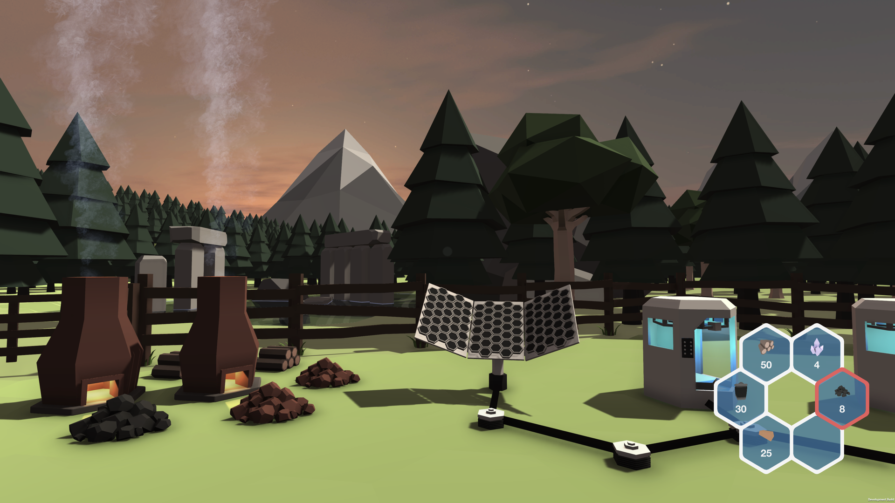
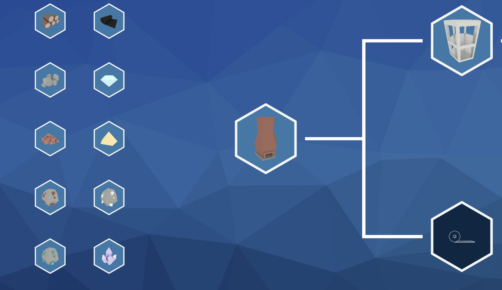
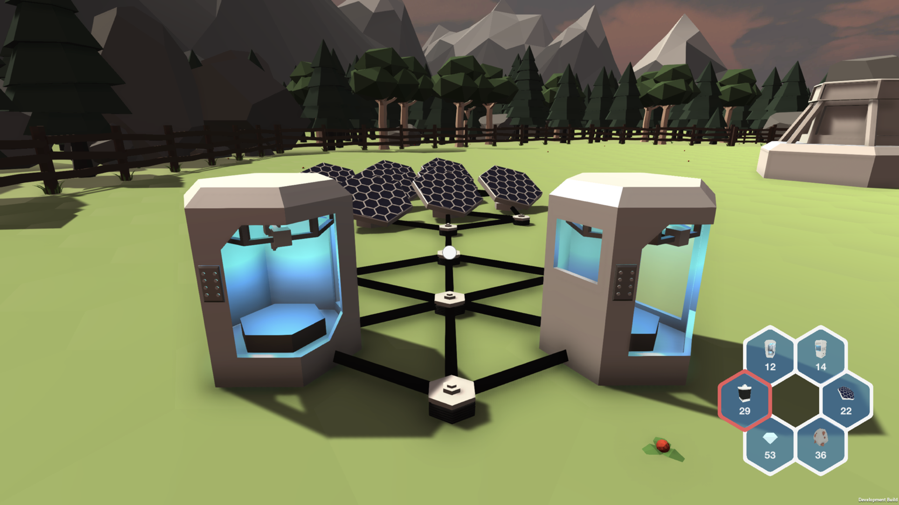
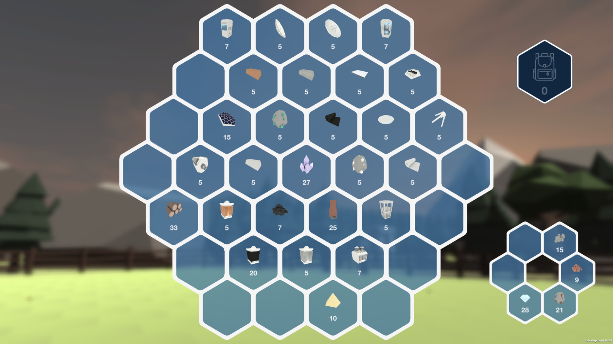

# Blueprint

Blueprint was created for the COMS30400 Group Project unit at the University of Bristol. 
This repository holds the *desktop* application used for playing Blueprint.

## Game Outline
Blueprint is a game inspired by Minecraft and Pokémon Go, where the player finds themselves stranded on a distant planet, but discovers blueprints for building a communication beacon.
In order to return home safely, they must build a communication beacon and signal for help using components and machines built from the discovered blueprints. 
However, there is a catch! The raw resources required to progress through the game cannot be collected on the desktop app - the player must log off and venture outside into the real world with the mobile app, and Hololens if paired, where they are presented with a map showing nearby raw resources the player can collect. 
Once the player is close enough to a resource, the player can tap on the resource to play an Augmented Reality minigame to collect some quantity of the resource, determined by the players performance in the game.
Utilising the cloud, we synchronise the entire game remotely - allowing the player to seamlessly pick up where the left off, from any internet connected device.
The end goal is simple: build each of the blueprints one by one until you have the resources to rebuild the communication beacon and return home.

## Technology Outline
- The project was built from scratch using Unity, using a bespoke state machine for storing and manipulating progress through the game.
- This state was stored remotely, using the associated [Cloud Server](https://github.com/manhattan-blueprint/Manhattan-Server).
- All of the 3D and 2D design elements used in the game were completely bespoke and created by members of the team.
- The accompanying soundtrack and sound effects were developed by Pablo Mogollon.

## Screenshots

